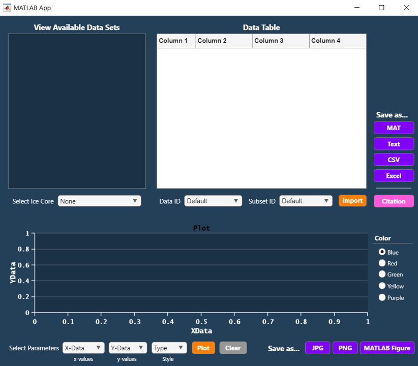

# <span style="color:D7BA7D"> **Byrd-ICP Data Analysis Package (MATLAB R2022a)** </span>

### **Why the Byrd-ICP Data Analysis Pacakge?**
This package is intended to hasten the process of acquiring ice core data from the Byrd Polar & Climate Research Center Ice Core Paleoclimatology Group (Byrd-ICP). All data in this package are available on the NOAA NCEI Paleo Data Search webpage: 

**https://www.ncei.noaa.gov/access/paleo-search/**

You will need to select the <strong>Ice Cores</strong> data type and choose "Mosley-Thompson, E." and "Thompson, L.G." from under the <strong>Investigators</strong> section of the page. Finally, click **SEARCH**.

_____

### **Timeline of Major Changes**
* 18 June 2023 - Added documentation for the new <small>`icecoreStruct()`</small> and <small>`dataID()`</small> fuctions, and documentation for the MATLAB app version of the package (i.e., `ByrdApp`).

-----
-----
# <span style="color:D7BA7D"> **App DOCUMENTATION** </span>
The Byrd-ICP Data Analysis package includes an interactive MATLAB GUI that allows the user to utilize the package's functionality without having to write any code. Simply call the `ByrdApp` function in the MATLAB command prompt and the application will open in a new window.

```matlab
>> ByrdApp
```



The `ByrdApp` function requires that you have the following files stored on your current MATLAB search path:

* <small>`ByrdApp.mlapp`</small>
* <small>`readICP.m`</small>
* <small>`icecoreStruct.m`</small>
* <small>`cite.m`</small>
* <small>`citations.txt`</small>

Accessing an ice core dataset in the Byrd-ICP application is as simple as selecting an item from a couple of drop-down menus. Below is a step-by-step example for importing the Puruogangri ice core data, plotting the oxygen stable isotope record, saving both the data set and the plot to your current MATLAB folder, and acquiring the citation information for the data.

-----

<big>**Example: Acquire data for the Puruogangri ice core**</big>

1. From the **Select Ice Core** drop-down menu, choose "Puruogangri". This will print a list of all the available data sets for the Puruogangri ice core inside of the **View Available Data Sets** box. In this case, there are two available data sets, which are given by unique data set IDs. The "puruogangri" data set contains six subsets, and the "puruogangri-TE" data contains two subsets. You get to decide which data set and which subset you would like to acquire.

2. From the **Data ID** drop-down menu, select "puruogangri". Doing so will auto-populate the **Subset ID** drop-down menu with the six subsets available for the "puruogangri" data set. From the **Subset ID** drop-down menu, select "C2-5yr-avg". This is a data set containing the ice core data for Puruogangri Core 2 averaged across 5yr intervals.

3. Click the orange <span style="color:orange"> **Import** </span> button to import the data from the NOAA NCEI Paleo Data Search repository. The data will appear inside the **Data Table** box with appropriate column headings.

4. You can save the data in the table to your current MATLAB folder by selecting any of the four purple icons to the right of the data table. If you wish to work with the data within the MATLAB environment, you can choose the <span style="color:violet">**MAT**</span> button to save the data as a  <small>`.mat`</small> file. Alternatively, choose the <span style="color:violet"> **Text** </span> button will save the data as a <small>`.txt`</small> file, the <span style="color:violet"> **CSV** </span> button will save the data as a <small>`.csv`</small> file, and the <span style="color:violet"> **Excel** </span> button will save the data a <small>`.xlsx`</small> file. 


5. To generate a quick plot from the data, go to the three **Select Parameters** drop-down menus at the bottom left of the GUI window. The first drop-down box is what you want to plot on the x-axis, the second drop-down box is what you want to plot on the y-axis, and the third drop-down box is the _style_ of plot that you wish to make. For the Puruogangri data set, you can select <small>`year_begin`</small> from the first drop-down, <small>`d18O`</small> from the second drop-down, and <small>`Line`</small> from the third drop-down. Then, click the orange <span style="color:orange"> **Plot** </span> button. This will produce a line plot of the oxygen isotope (δ<sup>18</sup>O) data. The gray <span style="color:#dfdfdf"> **Clear** </span> button clears the figure window. Change the color of the plot by selecting one of the radio buttons on the right and re-clicking <span style="color:orange"> **Plot** </span>.

6. To export the plot as an image file, select the purple <span style="color:violet"> **JPG** </span> or <span style="color:violet"> **PNG** </span> button. This will save the image to your current MATLAB folder. To save the plot as a figure file that can be edited further, click the purple <span style="color:violet"> **MATLAB Figure** </span> button. If you choose this option, the figure file will also be saved in your current MATLAB folder. To open the figure file (which has a <small>`.fig`</small> extension), you will need to type the following into the command prompt:
```matlab
>> openfig("file.fig","visible")
```
This command is necessary because the <span style="color:violet">**MATLAB Figure**</span> button disables the visibility of the figure by default. 

7. If you want to view the reference citaiton for the original data set, click the pink <span style="color:pink"> **Citation** </span> button next to the data table. This will print the citation information inside of the MATLAB command window, along with a DOI link to where the data is stored online. To view the metadata in its online repository, visit the Dataset DOI link, then, under the **Access** tab, click the "NOAA Study Page" link which will direct you to a webpage where you can view a table of the metadata.

-----

<big>**Notes on plotting in the Byrd-ICP application:**</big>

* Plotting multiple data sets in the same figure is **not recommended**, although it is possible in certain instances. For example, you can create a scatter plot and then overlay the scatter plot with a line plot from the same data set. You can also overlay multiple line plots (but not stairs or bar plots).

  * While you can apply different colors to multiple lines plotted within the same figure, the data are not given individual labels. To add a figure legend you will need to save the plot using the <span style="color:violet">**MATLAB Figure**</span> button and then edit the figure using the Property Inspector. 

* To avoid superimposing a new plot on top of the previous plot, click the gray <span style="color:#dfdfdf"> **Clear** </span> button before plotting.

* Future updates are planned to improve the plotting capabilities of the Byrd-ICP app, such as including a mechanism to superimpose plots disguishably and giving the user the ability to manually label objects in the figure window.

-----
-----
# <span style="color:D7BA7D"> **Function DOCUMENTATION** </span>
The package contains functions for automatically downloading published data from any ice core record collected by the BPCRC-ICP. Listed below are the available functions and their documentation (in alphabetical order).

-----
## **`ByrdApp()`**
Call the `ByrdApp()` function without any input arguments to open a GUI version of the Byrd-ICP Data Analysis Package. You do not need to include the parentheses in order for the app to open.

Function example
```matlab
>> ByrdApp
```

That's it! See the [**App Documentation**](#app-documentation) for details on using the GUI to the best of its abilities. 

-----
## **`citations()`**
This function prints an alphabetical list of all the available ice core data sets in the Byrd-ICP package, along with the original reference citation for the data set and a DOI link to where the data can be found on the NCEI website. **It takes no input arguments.** See `cite()` for printing the reference citation for a specified data set.

Function example
```matlab
>> citations % or citations()
```

**NOTE** The `citations()` function requires that you have the <small>`citations.txt`</small> file stored on your current MATLAB search path. 

-----
## **`cite(data_set_name_as_string)`**
This function prints the citation for a specified data set, along with a DOI link to where the data is stored on the NCEI website. Providing no input argument will print the citations for every data set (equivalent to the `citations()` function). Use the `datasets()` function to find the proper data set ID names. 

Function example:
```matlab
>> cite("quelccaya2003")
```

**NOTE** The `cite()` function requires that you have the <small>`citations.txt`</small> file stored on your current MATLAB search path. 

-----
## **`id = dataID(ice_core_struct)`**
This function is a useful alternative to the `datasets()` function, as it allows you to specify the ice core whose data sets you wish to view. The `dataID()` function prints the data set IDs and subset IDs for a specified ice core. **The function requires an input that is produced by the `icecoreStruct()` function.** The input must therefore be the of class `struct` and contain the field `DatasetID`.  

Function example:
```matlab
>> PG = icecoreStruct("puruogangri"); % Get struct for the Puruogangri ice core
>> dataID(PG) % Print valid data set IDs for the Puruogangri core

>> % Or, call on a single line:
>> dataID(icecoreStruct("puruogangri"))
```

-----
## **`datasets()`**
This function prints an alphabetical list of all data sets available within the package. Each data set in the list includes the data set ID that is used when calling the `readICP()` and `cite()` functions. It also prints a secondary list of all subsets within each individual data set, along with a description of what each subset contains. **This function takes no input arguments.**

Function example:
```matlab
>> datasets % or datasets()
```

**NOTE** The `datasets()` function requires that you have the <small>`datasets.txt`</small> file stored on your current MATLAB search path. 

-----
## **`icecore(core_name_as_string)`**
This function prints the geographical details and drilling information for a specified ice core site. The input is the name of an ice core or drilling location, **not** the name of the dataset.

Function example:
```matlab
>> icecore("Huascaran")
```

**NOTE** The `icecore()` function requires that you have the <small>`icecores.txt`</small> file stored on your current MATLAB search path. 

-----
## **`ds = icecoreStruct(name_as_string)`**
This function creates a `struct` variable that contains the geographical information, drilling information, data set IDs, and subset IDs for a specified ice core site. This function is best used in tandem with `dataID()` in order to quickly print the names of the available data sets for that ice core. Once you know the string ID for the data set(s) that you want to download, you can use those IDs to import the data using the `readICP()` function.

Function example:
```matlab
>> % Create struct for the Dunde ice core
>> dunde = icecoreStruct("dunde");

>> % Print available data set IDs for the Dunde ice core
>> dataID(dunde)
```

**NOTE** The input for the `icecoreStruct()` function is somewhat sensitive to capitalization, although several variations are accepted in most instances. For example, `"Guliya"` and `"guliya"` are both valid inputs (but not `"GULIYA"`). If the ice core has a multi-word name, the best practice is to use a space or hypthen to separate the words. For example, `"Windy Dome"` and `"windy-dome"` are both valid.

-----
## **`plt = icePlot(xData,yData,param_as_string)`**
This function has the same functionality as the base `plot()` function but improves upon the default visualization. You must specify two input arguments, with an optional third input:
1. **`xData`** - a vector containing the times or depths corresponding to each measurement in <small> `yData` </small>

2. **`yData`** - a vector containing the ice core measurements you wish to plot; be sure that the elements in <small>`yData`</small> are in the same order as they were when you originally imported them using <small>`readICP()`</small>. Or, if you have changed the order, be sure that the order of the elements in <small>`xData`</small> is equivalently reordered.

3. **`param_as_string`** - a string used for specifying the labels and style of the plot. It can be any of the following:

**PARAMETER** | **STRING** | **ASSUMED UNITS**
---|:---:|:---:
accumulation | `"acc"` | m ice equiv.
ammonium | `"nh4"` | ppb
black carbon | `"bc"` | pg/g
chloride | `"Cl"` | ppb
deuterium excess | `"dxs"` | permil (‰)
dust (total) | `"dust"` | counts/mL
nitrate | `"no3"` | ppb
sulfate | `"so4"` | ppb
oxygen isotopes | `"d18O"` | permil (‰)

To edit the plot, use dot-indexing in the same way that you would with any other plot. For example:

```matlab
>> plt = icePlot(xData,yData,"no3"); % Plot nitrate data
>> plt.LineWidth=2; % Change line thickness to 2
>> plt.Color='r'; % Change line color to red
>> legend('Nitrate Concentration') % Change contents of the figure legend
```

**NOTE** If specifying a third input to the `icePlot()` function, the y-axis will be given a default label depending on the parameter that you specified (see the third column of the table above). The label is not guaranteed to be consistent between data sets. For instance, by default, specifying `"no3"` as the third input will label the y-axis as `ppb`. While most of the nitrate concentration data sets are indeed given in units of ppb, some are in units of ppm. If you are unsure what the true units are supposed to be, you can go to the table properties of your data set and extract the variable units. For example:

```matlab
% Import table of data for the Sajama ice core
sajama = readICP("sajama","C1-100yr-avg");

% Check units of each variable
units = sajama.Properties.VariableUnits
```

Alternatively, you can visit the DOI link for the data set to check the metadata on the NCEI website (use the `cite()` function to print the correct DOI link). 

If you find that the default y-label within the `icePlot()` function is not correct for your data set, you can manually change the y-axis label by using the `ylabel` function (just as with normal MATLAB plots):

```matlab
>> myPlot = icePlot(xData,yData,"no3");
>> ylabel("ppm") % Changes ylabel from 'ppb' --> 'ppm'
```

-----
## **`data = readICP(data_set_ID,subset_ID)`**
This is the main function in the package. The `readICP()` function imports a table containing the data within a specified Byrd-ICP data set. **Input arguments must be given as strings.** The name of the data set ID can be found using the `datasets()` function, or by creating a `struct` with `icecoreStruct()` and then subsequently passing the output to `dataID()`. A second input is only required if the data set contains a subset.

Function example:
```matlab
>> BP = readICP("bruce-plateau","d18O");
```
The example above will produce a table named `BP` that contains the oxygen isotope data for the Bruce Plateau ice core. Note that subset IDs are different for every data set, so simply using `"d18O"` will not work in every case. Be sure to check the proper subset names using the documentation above.

Some data sets do not contain any subsets, in which case a second input is not needed:
```matlab
>> WD = readICP("windy-dome");
```

-----